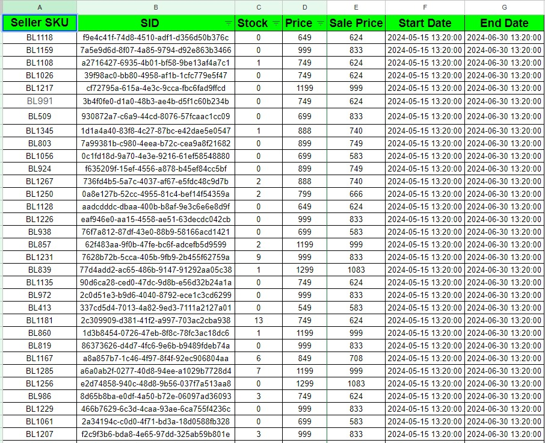
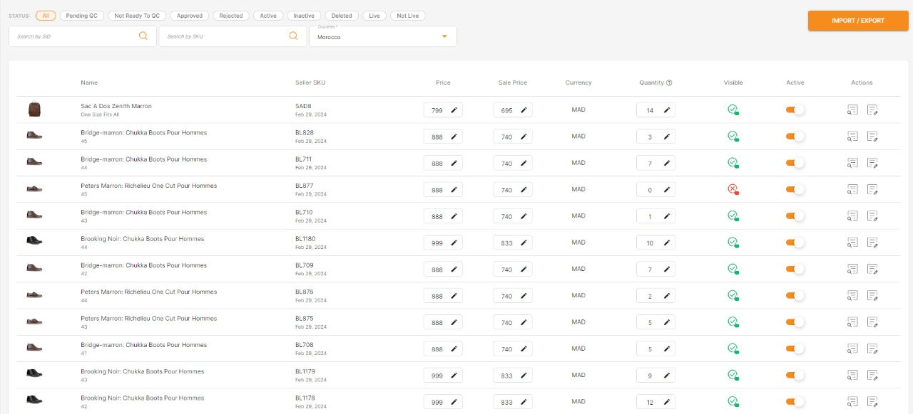

# Jumia API Integration with Google Sheets

## Overview

This project integrates the Jumia API with the Google Sheets API to manage and update product information. The primary functionality involves fetching product data from Jumia, storing it in a Google Sheet, and ensuring that product stock and prices are updated periodically.

## Integration Process

1. **Generate JWT Access Token from Jumia**
2. **Generate Google Sheets API Credentials**
3. **Integrate Jumia API with Google Sheets API**

### Updated Client Requirements

After initial development, the client requested new functionalities:

- Update product stock, price, and sale price every day at 4 PM, 8 PM, and 12 AM.
- Provide an option for the client to enable or disable automatic updates.
- Manage the refresh token, which expires periodically, through a client dashboard.

## Challenges

- **API Issues**: The Jumia API had several issues and was not fully ready. I had to contact Jumia support to resolve these issues.
- **Learning Curve**: I had to learn how to use the Google Sheets API.
- **Business Logic**: The initial business logic was unclear and required significant research and clarification.
- **Code Refactoring**: The initial code was procedural. I refactored it to an object-oriented approach.
- **Changing Requirements**: The client changed requirements multiple times, particularly regarding the frequency of product updates.

## How to Use

1. Fetch the Git repository.
2. Run `composer install`.
3. Integrate the Google Sheets API.
4. Integrate the Jumia API.
5. Run `index.php`.

### Note

I ignore google sheet credentials.

## Dependencies

- PHP
- Composer
- Jumia API
- Google API PHP Client
- Google Sheets API PHP Client

## Images

**Google Sheet**

Jumia Platform provides an API for real-time price and stock updates. The client's requirement is to have access to modify these values if necessary. I have chosen Google Sheets to input the API values, allowing the client to modify or change them as needed. I will then insert these values into a database to perform further tasks.

**Login Form**

**Dashboard**

**Control Panel**

The update process runs in the background and is functioning well. However, the client needs to control these updates. I had to develop a dashboard with a proper login system to manage the automatic updates.

**Shop Dashboard**

Finally, the products are fully updated

## Author

[Muhammad Shah Jalal](https://github.com/shahjalal132)
